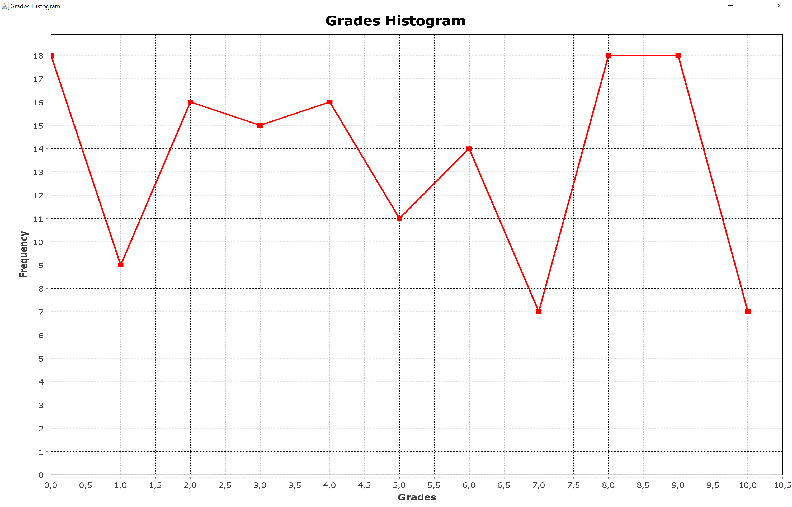

# LabAssignments-SEiP-2020

This repository serves as a storage for my assignments for the needs of the Software Engineering in Practice (SEiP) course during my 6th semester offered by the Department of Management Science & Technology of Athens University of Economics and Business.

## First Assignment

The first assignment concerns a Java application that reads a file, which contains students' grades, and generates a histogram.

### Prerequisites

1. Setup Maven in Windows/Linux/Mac - [guidelines](https://www.baeldung.com/install-maven-on-windows-linux-mac)
2. Clone this repository

### Running the project

First assignment its a multi-module Maven project. It consists of a parent Maven project `seip2020_practical_assignments` and a sub-module `gradeshistogram`.

The sub-module its the one which generates the histogram. In order to accomplish this is using the [JFreeChart](https://mvnrepository.com/artifact/org.jfree/jfreechart) library.

In order to build all modules execute these command in the repository `seip2020_practical_assignments` directory:

```
mvn package
```

This command generates a jar file in sub-module's corresponding target (gradeshistogram/target) directory.


### Grades' histogram

This module uses the `maven-assembly-plugin` for packaging the external dependency, which is required, into the main .jar output file. For this plugin, you need to define the class that contains the main method.

```xml
<plugin>
	<artifactId>maven-assembly-plugin</artifactId>
	<configuration>
		<archive>
			<manifest>
				<mainClass>gradeshistogram.HistogramGenerator</mainClass>
			</manifest>
		</archive>
		<descriptorRefs>
			<descriptorRef>jar-with-dependencies</descriptorRef>
		</descriptorRefs>
	</configuration>
	<executions>
		<execution>
			<id>jar-with-dependencies</id>
			<phase>package</phase>
			<goals>
				<goal>single</goal>
			</goals>
		</execution>
	</executions>
</plugin>
```

The produced jar is located in the target directory of the sub-module Grades Histogram and can be executed as following:

```
java -jar gradeshistogram/target/gradeshistogram-0.0.1-SNAPSHOT-jar-with-dependencies.jar gradeshistogram/src/main/resources/grades.txt
```

Running the above command will result in this chart:




*Note: gradeshistogram-0.0.1-SNAPSHOT.jar is not executable*
